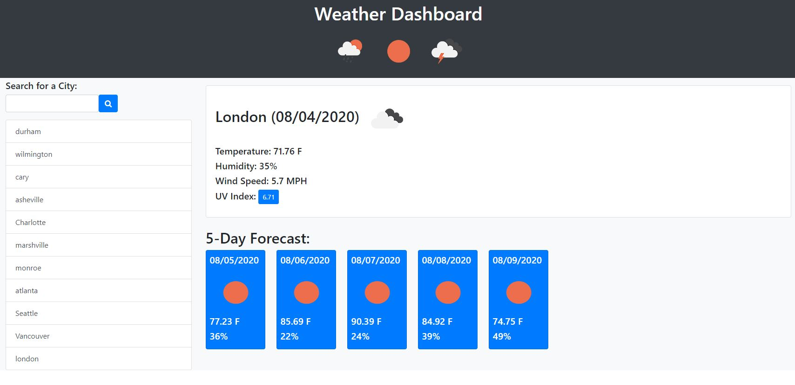

# Earthlight Weather Finder 
   

  Here is a weather app that lets the user search by cities. Once the user enters a city the weather information if pulled from the Open Weather Map API. That information is displayed using JavaScript and jQuery. The searched cities are also saved in the local storage of the browser and the user can jump back to those cities in the history section.

  Here is a link to the application: https://wilsoncollin7.github.io/weather-dashboard/

  

    
    
  

  ## Table of Contents

  - [Installation](#installation)
  - [Usage](#usage)
  - [License](#license)
  - [Contributing](#contributing)
  - [Tests](#tests)
  - [Questions](#questions)

  ## Installation

  You can clone the repo and run the application on your default browser, or you can use the live link to run it right away.

  ## Usage

  This project uses dynamic HTML, CSS, JavaScript, jQuery, Ajax, and Bootstrap to create this application. The user inputs a city, which is then ran through the Open Weather Map API. The today weather, 5-day forecast, and the heat index are all pulled and displayed. The entire application is mobile responsive and return to be turned into an app!

  ## License

  This application is made with the [MIT License](https://opensource.org/licenses/MIT)

  ## Contributing

  To contribute please contact me and we can see what we can do!

  ## Tests

  If you run the application and find any bugs or errors, please document them and contact me!

  ## Questions

  For any questions you might have, you can email me at wilsoncollin7@gmail.com. You can also check out my [GitHub Profile](https://github.com/wilsoncollin7).
